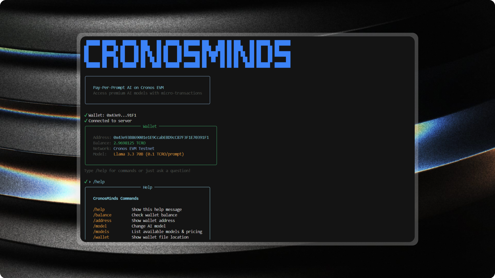

# CronosMinds



**Pay-Per-Prompt AI Access via Smart Contracts on Cronos**

A decentralized pay-per-prompt application that enables users to access premium AI models (GPT-4o, Gemini, Llama) by paying with TCRO through a smart contract on the Cronos EVM Testnet.

**🌐 Live Backend:** [https://cronos-x402.onrender.com/](https://cronos-x402.onrender.com/)  
**💚 Health Check:** [https://cronos-x402.onrender.com/health](https://cronos-x402.onrender.com/health)  
**📜 Smart Contract:** [`0xECD472EFd86460F8f2BD011bA3BeA8ba6A04Da3f`](https://explorer.cronos.org/testnet/address/0xECD472EFd86460F8f2BD011bA3BeA8ba6A04Da3f) (Cronos Testnet)

---

## Table of Contents

- [Motivation](#motivation)
- [Use Cases](#use-cases)
- [Architecture](#architecture)
- [Tech Stack](#tech-stack)
- [Project Structure](#project-structure)
- [Getting Started](#getting-started)
  - [Prerequisites](#prerequisites)
  - [Smart Contract Deployment](#smart-contract-deployment)
  - [Backend Setup](#backend-setup)
  - [CLI Setup](#cli-setup)
- [Usage](#usage)
- [Smart Contract](#smart-contract)
- [API Reference](#api-reference)
- [Configuration](#configuration)
- [Contributing](#contributing)
- [License](#license)

---

## Motivation

Traditional AI API access requires:
- Credit card payments and subscriptions
- Centralized billing systems
- Trust in third-party payment processors
- Geographic restrictions

**CronosMinds** solves these problems by:
- Enabling **micropayments** for individual AI prompts
- Using **blockchain** for transparent, trustless payments
- Providing **on-chain proof** of every transaction
- Allowing **anyone with crypto** to access premium AI models
- Tracking **usage statistics** immutably on-chain

---

## Use Cases

1. **Pay-As-You-Go AI Access**: No subscriptions, pay only for what you use
2. **Decentralized AI Gateway**: Access multiple AI providers through a single interface
3. **Transparent Pricing**: Model costs stored on-chain, verifiable by anyone
4. **Usage Analytics**: On-chain tracking of prompts per user
5. **Developer API**: Build applications on top of the payment infrastructure

---

## Architecture

```
┌─────────────────────────────────────────────────────────────────────────────┐
│                              USER (CLI)                                      │
│  - Create/Import Wallet                                                      │
│  - Select AI Model                                                           │
│  - Enter Prompt                                                              │
└─────────────────────────────────────────────────────────────────────────────┘
                                    │
                                    ▼
┌─────────────────────────────────────────────────────────────────────────────┐
│                        CRONOS EVM TESTNET                                    │
│  ┌─────────────────────────────────────────────────────────────────────┐    │
│  │              CronosMindsPayment Smart Contract                       │    │
│  │  - payForPrompt(model) payable                                       │    │
│  │  - Emits PromptPaid(user, model, amount, timestamp, userTotalPrompts)│    │
│  │  - Tracks per-user stats (totalPrompts, totalSpent)                  │    │
│  │  - Owner can withdraw funds                                          │    │
│  └─────────────────────────────────────────────────────────────────────┘    │
└─────────────────────────────────────────────────────────────────────────────┘
                                    │
                                    │ Transaction Hash
                                    ▼
┌─────────────────────────────────────────────────────────────────────────────┐
│                              BACKEND                                         │
│  - Receives prompt + tx hash                                                 │
│  - Verifies PromptPaid event on-chain                                        │
│  - Validates: amount, model, user                                            │
│  - Replay protection (each tx hash used once)                                │
│  - Calls AI provider (OpenAI, Google, Groq)                                  │
│  - Returns AI response                                                       │
└─────────────────────────────────────────────────────────────────────────────┘
```

### Payment Flow

1. User selects an AI model and enters a prompt
2. CLI calls `payForPrompt(model)` on the smart contract with TCRO
3. Contract emits `PromptPaid` event and updates user stats
4. CLI sends prompt + transaction hash to backend
5. Backend verifies the `PromptPaid` event on-chain
6. Backend calls the AI provider and returns the response
7. User sees the AI response with transaction proof

---

## Tech Stack

| Component | Technology |
|-----------|------------|
| Smart Contract | Solidity 0.8.19, Foundry |
| Backend | Node.js, Express, TypeScript |
| CLI | Node.js, TypeScript, Inquirer, Chalk |
| Blockchain | Cronos EVM Testnet (Chain ID: 338) |
| AI Providers | OpenAI, Google Gemini, Groq |
| Web3 | ethers.js v6 |

---

## Project Structure

```
cronos-x402/
├── contracts/                    # Smart Contract (Foundry)
│   ├── src/
│   │   └── CronosMindsPayment.sol
│   ├── test/
│   ├── script/
│   └── foundry.toml
│
├── backend/                      # Express.js API Server
│   ├── src/
│   │   ├── index.ts             # Server entry point
│   │   ├── routes/
│   │   │   └── chatRouter.ts    # POST /chat endpoint
│   │   ├── middleware/
│   │   │   └── paymentMiddleware.ts  # On-chain verification
│   │   ├── controllers/
│   │   │   └── chatController.ts     # AI request handler
│   │   ├── services/
│   │   │   └── aiService.ts     # AI provider abstraction
│   │   └── config/
│   │       ├── pricing.ts       # Model costs
│   │       ├── contract.ts      # Contract ABI
│   │       └── provider.ts      # Cronos RPC
│   └── package.json
│
├── cli/                          # Interactive CLI
│   ├── src/
│   │   ├── index.ts             # CLI entry point
│   │   ├── cli.ts               # Main interactive loop
│   │   ├── utils/
│   │   │   ├── wallet.ts        # Payment via contract
│   │   │   ├── contract.ts      # Contract ABI
│   │   │   ├── api.ts           # Backend API calls
│   │   │   └── config.ts        # Environment config
│   │   └── wallet/
│   │       └── walletManager.ts # Wallet persistence
│   └── package.json
│
├── .env.example                  # Environment template
└── README.md
```

---

## Getting Started

### Prerequisites

- **Node.js** v18+
- **Foundry** (for smart contract deployment)
- **TCRO** tokens from [Cronos Faucet](https://cronos.org/faucet)

### Smart Contract Deployment

1. Navigate to the contracts directory:
   ```bash
   cd contracts
   ```

2. Build the contract:
   ```bash
   forge build
   ```

3. Deploy to Cronos Testnet:
   ```bash
   forge create src/CronosMindsPayment.sol:CronosMindsPayment \
     --rpc-url https://evm-t3.cronos.org \
     --private-key YOUR_PRIVATE_KEY
   ```

4. Save the deployed contract address for the next steps.

### Backend Setup

1. Navigate to the backend directory:
   ```bash
   cd backend
   ```

2. Install dependencies:
   ```bash
   npm install
   ```

3. Create environment file:
   ```bash
   cp ../.env.example .env
   ```

4. Configure `.env`:
   ```env
   # Required
   CONTRACT_ADDRESS=0xYourDeployedContractAddress

   # AI API Keys (at least one required)
   GOOGLE_API_KEY=your-google-api-key
   groq_API_KEY=your-groq-api-key
   OPENAI_API_KEY=your-openai-api-key

   # Optional
   USE_MOCK_AI=false
   PORT=3000
   ```

5. Start the server:
   ```bash
   npm run dev
   ```

### CLI Setup

1. Navigate to the CLI directory:
   ```bash
   cd cli
   ```

2. Install dependencies:
   ```bash
   npm install
   ```

3. Create environment file:
   ```bash
   cp ../.env.example .env
   ```

4. Configure `.env`:
   ```env
   CONTRACT_ADDRESS=0xYourDeployedContractAddress
   API_URL=http://localhost:3000
   ```

5. Build and run:
   ```bash
   npm run build
   npm start
   ```

---

## Usage

> **⚠️ Current Model Status:**
> - ✅ **Groq (Llama 3.3 70B)**: Working fine
> - ⚠️ **Gemini Models**: May experience rate limiting with free API keys
> - ⚠️ **GPT Models**: May experience rate limiting with free API keys

### First Run

On first launch, the CLI will guide you through wallet setup:

```
┌─────────────────────────────────┐
│       First Time Setup          │
├─────────────────────────────────┤
│ Welcome to CronosMinds!         │
│ Let's set up your wallet.       │
└─────────────────────────────────┘

? How would you like to set up your wallet?
  > Create a new wallet
    Import existing wallet (private key)
```

### CLI Commands

| Command | Description |
|---------|-------------|
| `/help` | Show all commands |
| `/balance` | Check TCRO balance |
| `/address` | Show wallet address |
| `/model` | Change AI model |
| `/models` | List available models with pricing |
| `/wallet` | Show wallet file location |
| `/clear` | Clear the screen |
| `/exit` | Quit the application |

### Making a Prompt

Simply type your question and press Enter:

```
› What is the capital of France?

? Send 0.1 TCRO to use Llama 3.3 70B? (Y/n)

✔ Paid! TX: 0x1234...abcd

┌─────────────────────────────────┐
│        Llama 3.3 70B            │
├─────────────────────────────────┤
│ The capital of France is Paris. │
└─────────────────────────────────┘

TX: 0x1234567890abcdef...
```

---

## Smart Contract

### CronosMindsPayment.sol

**Core Functions:**

| Function | Description |
|----------|-------------|
| `payForPrompt(string model)` | Pay for a prompt (payable) |
| `getModelPrice(string model)` | Get price for a model |
| `getUserStats(address user)` | Get user's usage stats |
| `getSupportedModels()` | List all supported models |
| `withdraw()` | Owner withdraws funds |
| `setModelPrice(string, uint256)` | Owner updates pricing |

**Events:**

```solidity
event PromptPaid(
    address indexed user,
    string indexed model,
    uint256 amount,
    uint256 timestamp,
    uint256 userTotalPrompts
);
```

**Model Pricing (Default):**

| Model | Price (TCRO) |
|-------|--------------|
| groq | 0.1 |
| gemini-2.0-flash | 0.15 |
| gemini-2.5-flash | 0.2 |
| gemini-2.5-pro | 0.5 |

> **Note:** Currently, the **Groq model is working fine**. Gemini models may experience rate limiting when using free-tier API keys. For production use, consider upgrading to paid API keys for better rate limits and reliability.

---

## API Reference

### POST /chat

Submit a prompt after payment.

**Headers:**
```
x-payment-hash: 0x<transaction_hash>
Content-Type: application/json
```

**Body:**
```json
{
  "prompt": "Your question here",
  "model": "groq"
}
```

**Success Response (200):**
```json
{
  "success": true,
  "txHash": "0x...",
  "model": "Llama 3.3 70B",
  "response": "AI response here..."
}
```

**Error Responses:**

| Code | Error | Description |
|------|-------|-------------|
| 402 | Payment Required | Missing payment hash |
| 403 | Duplicate Transaction | TX already used |
| 400 | Invalid Payment | Various validation errors |

### GET /health

Health check endpoint.

### GET /info

Server info and model pricing.

---

## Configuration

### Environment Variables

| Variable | Required | Description |
|----------|----------|-------------|
| `CONTRACT_ADDRESS` | Yes | Deployed contract address |
| `CRONOS_RPC_URL` | No | RPC URL (default: https://evm-t3.cronos.org) |
| `API_URL` | No | Backend URL for CLI (default: http://localhost:3000) |
| `PORT` | No | Backend port (default: 3000) |
| `USE_MOCK_AI` | No | Use mock responses for testing |
| `OPENAI_API_KEY` | No* | OpenAI API key |
| `GOOGLE_API_KEY` | No* | Google Gemini API key |
| `groq_API_KEY` | No* | Groq API key |

*At least one AI API key is required unless `USE_MOCK_AI=true`

### Network Information

| Property | Value |
|----------|-------|
| Network | Cronos EVM Testnet |
| Chain ID | 338 |
| RPC URL | https://evm-t3.cronos.org |
| Currency | TCRO |
| Explorer | https://explorer.cronos.org/testnet |
| Faucet | https://cronos.org/faucet |

---

## Contributing

Contributions are welcome! Here's how to get started:

### Development Setup

1. Fork the repository

2. Clone your fork:
   ```bash
   git clone https://github.com/nikhilxhub/cronos-x402
   cd cronos-x402
   ```

3. Install all dependencies:
   ```bash
   # Backend
   cd backend && npm install

   # CLI
   cd ../cli && npm install

   # Contracts
   cd ../contracts && forge install
   ```

4. Create a branch for your feature:
   ```bash
   git checkout -b feature/your-feature-name
   ```

### Code Style

- Use TypeScript for all backend and CLI code
- Follow existing patterns in the codebase
- Add comments for complex logic
- Keep functions small and focused

### Testing

```bash
# Test smart contract
cd contracts && forge test

# Build backend
cd backend && npm run build

# Build CLI
cd cli && npm run build
```

### Pull Request Process

1. Ensure your code builds without errors
2. Update documentation if needed
3. Create a Pull Request with a clear description
4. Link any related issues

### Areas for Contribution

- [ ] Add more AI providers
- [ ] Implement subscription/prepaid credits model
- [ ] Add web frontend
- [ ] Write comprehensive tests
- [ ] Add mainnet deployment scripts
- [ ] Implement rate limiting
- [ ] Add user dashboard for usage stats

---

## License

MIT License - see [LICENSE](LICENSE) for details.

---

## Acknowledgments

- Built for the Cronos Hackathon
- Powered by Cronos EVM
- AI providers: OpenAI, Google, Groq

---

**Questions?** Open an issue or reach out to the maintainers.
